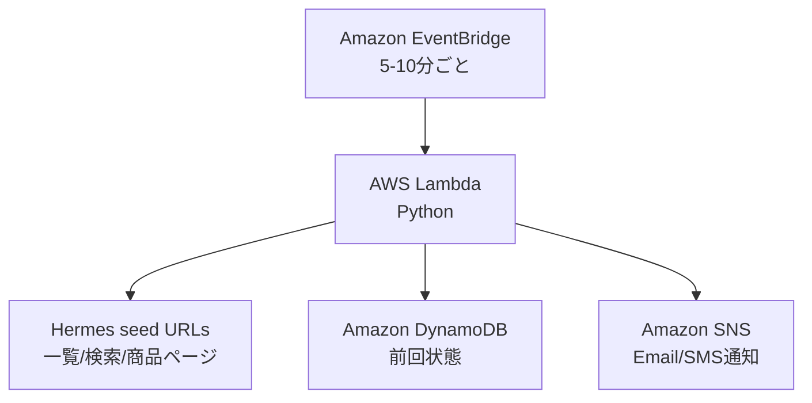

# hermes_notification_chaine_dancre

エルメス公式サイトの指定URLを定期確認し、シェーヌダンクルの `GM` / `TGM` が購入可能になったらメール通知するための AWS CDK プロジェクトです。

Lambda は Python で実装しています。構成は次の通りです。



## アーキテクチャ

Lambda 内は Clean Architecture に寄せて、外部I/Oと業務ルールを分離しています。

```text
lambda/monitor/
├── app.py                                      # Lambda entrypoint
├── local_check.py                              # ローカル確認用CLI
└── hermes_notification_chaine_dancre/
    ├── domain/                                 # 商品状態、入荷判定ポリシー
    ├── application/                            # ユースケース、ポート、設定
    └── infrastructure/                         # Hermes HTTP、DynamoDB、SNS
```

依存方向は `infrastructure -> application -> domain` です。`application` は DynamoDB、SNS、HTTP を直接知りません。

## 作成されるAWSリソース

- EventBridge Rule: 指定間隔で Lambda を起動
- Lambda: 商品一覧/商品ページを取得し、対象商品の購入可否を判定
- DynamoDB: 商品ごとの前回状態を保存
- SNS Topic: 入荷通知メール/SMSを配信

## セットアップ

```bash
python3 -m venv .venv
source .venv/bin/activate
pip install -r requirements.txt -r requirements-dev.txt
```

AWS 認証情報を設定したうえで、初回のみ bootstrap します。

```bash
cdk bootstrap aws://ACCOUNT_ID/ap-northeast-1
```

デプロイ例です。`seedUrls` にはエルメス公式サイト上の検索結果URL、カテゴリURL、または商品ページURLをカンマ区切りで指定してください。

```bash
cdk deploy HermesNotificationChaineDancreStack \
  -c notificationEmails="you@example.com" \
  -c notificationPhoneNumbers="+819012345678" \
  -c seedUrls="https://www.hermes.com/jp/ja/" \
  -c scheduleMinutes=5
```

SNS Email は初回デプロイ後、送信先メールアドレスに確認メールが届きます。メール内の確認リンクを開くまで通知は配信されません。SMS は E.164 形式、たとえば日本の番号なら `+819012345678` のように指定します。SMS 配信可否や上限は AWS アカウントと国ごとの SNS SMS 設定に依存します。

## 主な設定

CDK context または環境変数で変更できます。

| 設定 | 既定値 | 説明 |
| --- | --- | --- |
| `notificationEmail` | なし | SNS Email の通知先。単体指定用 |
| `notificationEmails` | なし | SNS Email の通知先。カンマ区切り |
| `notificationPhoneNumber` | なし | SNS SMS の通知先。単体指定用 |
| `notificationPhoneNumbers` | なし | SNS SMS の通知先。カンマ区切り |
| `notificationTimezone` | `Asia/Tokyo` | 通知本文と DynamoDB に保存する確認時刻のタイムゾーン |
| `seedUrls` | なし | クロール開始URL。カンマ区切り |
| `allowedHosts` | `hermes.com` | クロールを許可するホスト。カンマ区切り |
| `scheduleMinutes` | `5` | EventBridge 実行間隔 |
| `targetKeywords` | `シェーヌ・ダンクル,シェーヌダンクル,chaine d'ancre,chaine-d-ancre,chaîne d'ancre` | 対象商品名の判定キーワード |
| `targetSizes` | `GM,TGM` | 対象サイズ |
| `notifyOnFirstAvailable` | `true` | 初回チェック時点で購入可能なら通知するか |
| `pageLimit` | `12` | 1回の実行で取得する最大ページ数 |
| `fetchDelayMs` | `700` | 連続取得の待機時間 |

環境変数で指定する場合は、同名の大文字スネークケースを使います。プロジェクト直下に `.env` を置いた場合も `app.py` が読み込みます。

```bash
cp .env.example .env
# .env 内の通知先と seed URL を編集
cdk deploy HermesNotificationChaineDancreStack
```

## クロールの仕組み

1回の Lambda 実行では、`seedUrls` で指定した URL を起点に `allowedHosts` で許可された HTTPS URL だけを辿ります。商品ページらしい URL、または `targetKeywords` に一致する URL をキューに追加し、`pageLimit` に達するまで取得します。

各ページでは、まず `application/ld+json` の Product schema から商品名、SKU、availability を読みます。取れない場合は `og:title`、`h1`、`title`、本文テキストを使って補完します。対象判定は `targetKeywords` に `シェーヌダンクル` 系の文字列が含まれるか、かつ `targetSizes` の `GM` / `TGM` が見つかるかで行います。

購入可否は JSON-LD の `InStock` / `OutOfStock` を優先し、取れない場合は「カートに追加」「在庫なし」などのページ内文言で fallback 判定します。前回 DynamoDB で `available=false`、今回 `available=true` になった場合に SNS へ通知します。

## ローカル確認

DynamoDB や SNS を使わず、指定URLの解析結果だけを表示できます。

```bash
python lambda/monitor/local_check.py \
  --seed-url "https://www.hermes.com/jp/ja/" \
  --page-limit 3
```

## テスト

```bash
pytest
```

## 運用上の注意

- 公式サイトの利用規約や `robots.txt` を確認し、過剰なアクセスや購入自動化は避けてください。
- このプロジェクトは在庫検知と通知だけを行い、購入処理は実装していません。
- Hermes 側のページ構造や bot 対策は変わる可能性があります。通知が来ない/誤検知がある場合は `targetKeywords`、`seedUrls`、パーサーの調整が必要です。
- 5分間隔でも `pageLimit` を上げすぎるとアクセス量が増えます。まずは商品ページURLを直接 seed にするのが安定します。

## セキュリティ設定

- Lambda の DynamoDB 権限は対象テーブルへの `GetItem` / `PutItem` のみに制限しています。
- Lambda の SNS 権限は対象トピックへの `Publish` のみに制限しています。
- Lambda の同時実行数は `1` に制限し、重複クロールを抑えています。
- CloudWatch Logs の保持期間は 1 か月です。
- `.env` は `.gitignore` 対象です。電話番号などの通知先は `.env.example` ではなく `.env` にだけ設定してください。
